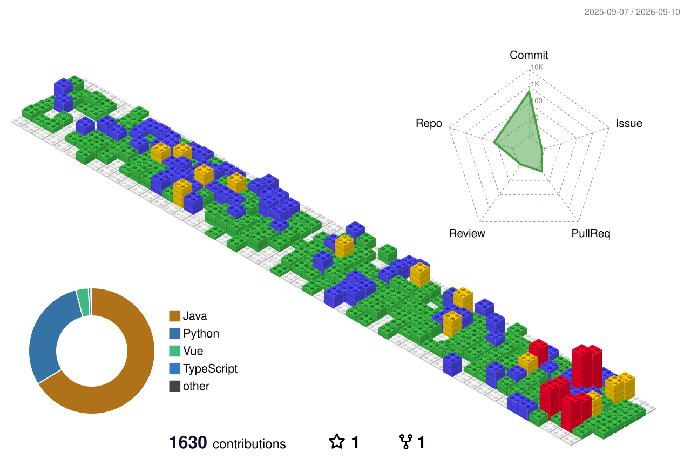

<p align="center">
  
</p>

<p align="center">
  
</p>

<p align="center">
  <a href="#-进入驾驶舱">⌘ 驾驶舱</a> &nbsp; / &nbsp;
  <a href="#-舷窗之外">◈ 舷窗之外</a> &nbsp; / &nbsp;
  <a href="#-未知信号">⌁ 未知信号</a>
</p>

<br />

<p align="center"><b>这里没有标准答案，只有一些正在发生的好奇心。</b><br /><sub>A small corner of the internet. An open window to the unknown.</sub></p>

<br />

<p align="center">
  <picture>
    <source media="(prefers-color-scheme: dark)" srcset="https://cdn.jsdelivr.net/gh/sun0225SUN/sun0225SUN/assets/images/coding.gif" />
    <source media="(prefers-color-scheme: light)" srcset="https://cdn.jsdelivr.net/gh/sun0225SUN/sun0225SUN/assets/images/developer.svg" />
    
  </picture>
</p>

<p align="center">
  <a href="https://github.com/xiaozhaoben"></a>
  <a href="https://github.com/xiaozhaoben?tab=stars"></a>
</p>


### ⌘ 进入驾驶舱

```text
┌  xiaozhaoben@universe ~
│
├  $ connect --destination unknown
│  接入成功。欢迎来到这片小小的数字宇宙。
│
├  $ cat navigation.conf
│  direction  = 跟着好奇心走
│  fuel       = 一个突如其来的想法
│  autopilot  = off
│
└  $ _
```

<p align="center"><samp>[ 探索未知 ] &nbsp; [ 保持热爱 ] &nbsp; [ 偶尔放空 ]</samp></p>

<br />

### 🐍 像素吞噬者

<p align="center"><sub>每一次贡献，都是这条小蛇的下一口能量。</sub></p>

<picture>
  <source media="(prefers-color-scheme: dark)" srcset="./profile-snake-contrib/github-snake-dark.svg" />
  
</picture>

<p align="center"><a href="https://platane.github.io/snk/">🎮 打开贪吃蛇算法互动演示 ↗</a></p>


### 📡 轨道遥测

<p align="center"><sub>一段时间里的小小行动，也会连成轨迹。</sub></p>

<p align="center"><a href="https://github.com/xiaozhaoben"></a></p>

### 🌃 我的像素城市

<picture>
  <source media="(prefers-color-scheme: dark)" srcset="./profile-3d-contrib/profile-night-rainbow.svg" />
  
</picture>

<p align="center"><sub>把日常的积累，慢慢建成一座城市。</sub></p>


### ◈ 舷窗之外

<a href="https://images.nasa.gov/details/carina_nebula">
  
</a>

<p align="center"><sub>NASA / ESA / CSA / STScI · Webb's Cosmic Cliffs<br />点击舷窗，查看这片真实宇宙的影像。</sub></p>

<p align="center"><i>屏幕只有几寸，想象力可以很远。</i></p>

<br />

<p align="center"></p>

### ⌁ 未知信号

<details>
<summary><b>📡 收到一段加密通信，点击解码</b></summary>

<br />

```text
SIGNAL DECODED
──────────────
48 65 6C 6C 6F 2C 20 57 6F 72 6C 64 21

> Hello, World!
> 原来每一次远航，都从一句问候开始。
```

</details>

<details>
<summary><b>🧑‍🚀 打开宇航服口袋</b></summary>

<br />

里面有一颗没有命名的小行星、一张通往明天的船票，以及一句写给自己的话：

> 不必每次出发都知道终点。

口袋检查完毕，可以继续漫游了。

</details>

<details>
<summary><b>🔴 请勿按下这个按钮</b></summary>

<br />

```text
[ UNIVERSE RESTART REQUEST ]

正在保存好奇心……完成。
正在清理内耗缓存……完成。
正在重新载入今天……完成。

你没有重启宇宙。
不过，现在是重新开始的好时机。
```

</details>

<br />

<p align="center">
  <a href="https://github.com/xiaozhaoben?tab=stars">✦ 看看我收藏的星星</a>
  &nbsp; · &nbsp;
  <a href="https://github.com/xiaozhaoben">↗ 返回我的轨道</a>
</p>

<p align="center"><samp>END OF TRANSMISSION · NOT THE END OF EXPLORATION</samp></p>

<details>
<summary>Visual credits · 灵感与组件</summary>

布局与编程插画、光流分隔线、人物插画参考并引用自 [sun0225SUN/sun0225SUN](https://github.com/sun0225SUN/sun0225SUN)。
贡献动画使用 [Platane/snk](https://github.com/Platane/snk)，3D 城市使用 [github-profile-3d-contrib](https://github.com/yoshi389111/github-profile-3d-contrib)，贡献日历由 [GitHub Chart](https://ghchart.rshah.org) 提供。
横幅使用 [capsule-render](https://github.com/kyechan99/capsule-render)，打字使用 [readme-typing-svg](https://github.com/DenverCoder1/readme-typing-svg)。星云署名见图片下方。

</details>


